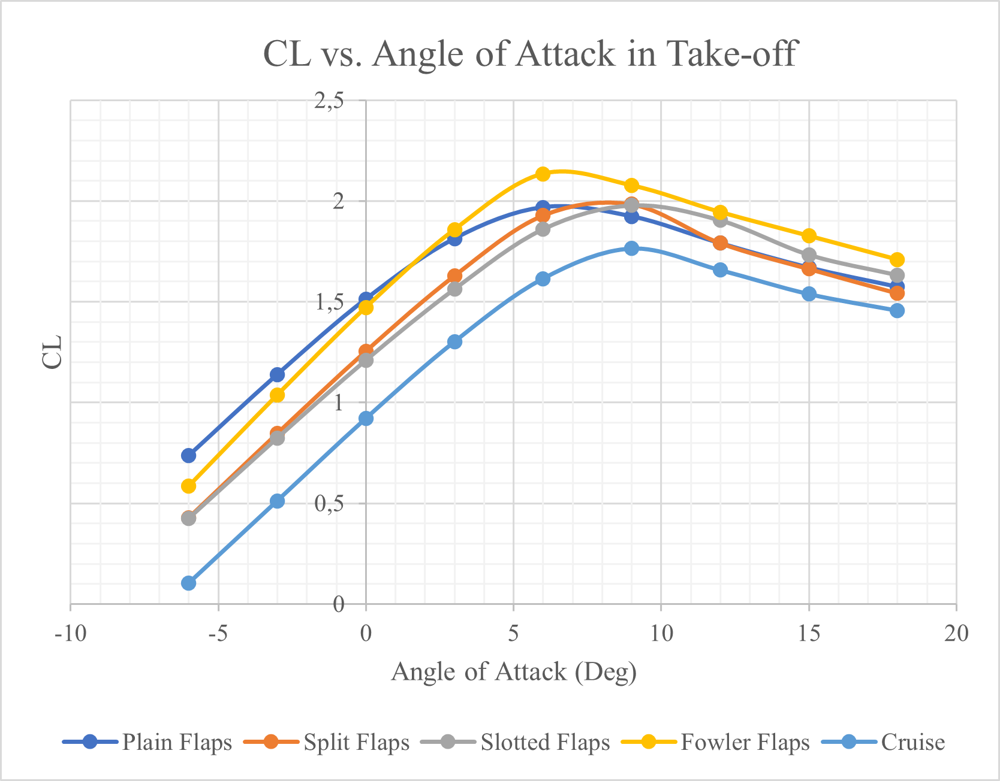
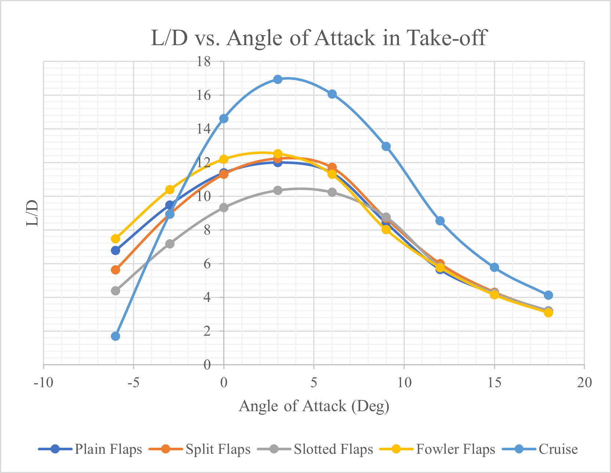
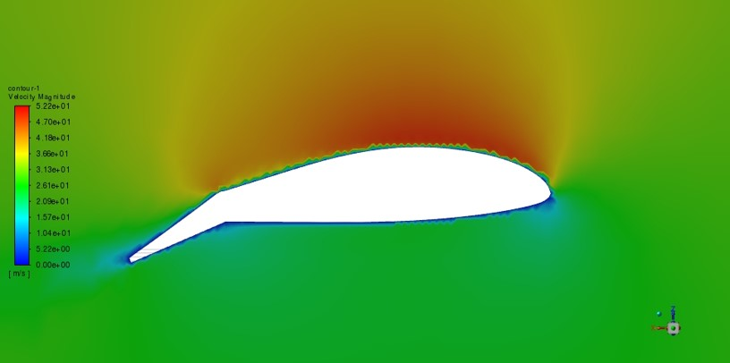
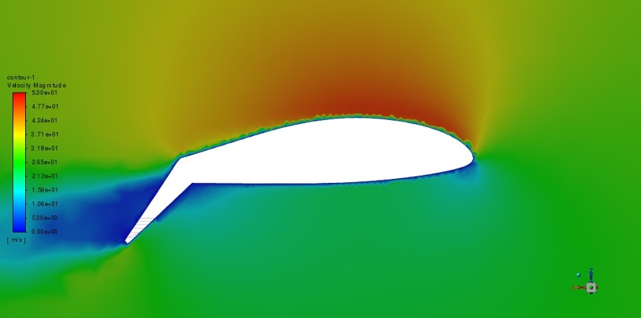
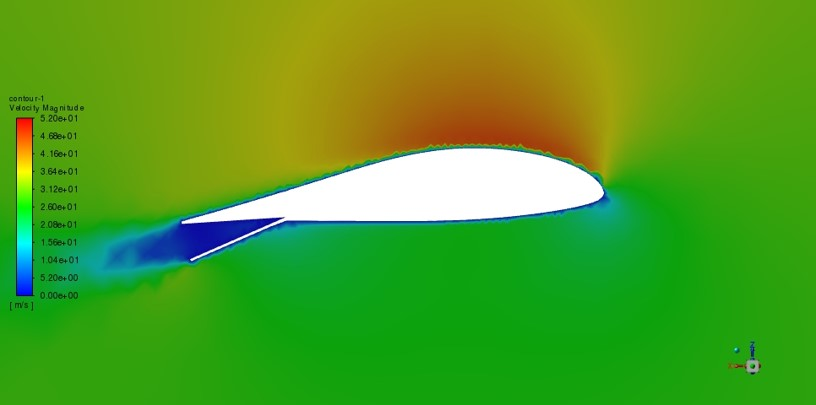
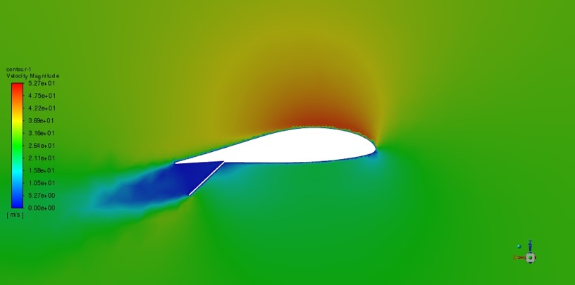
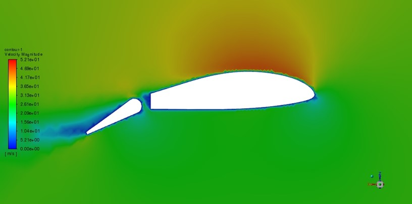
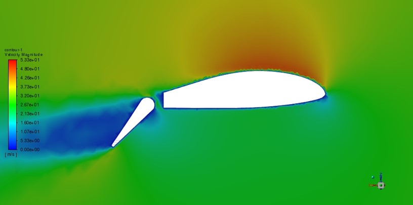
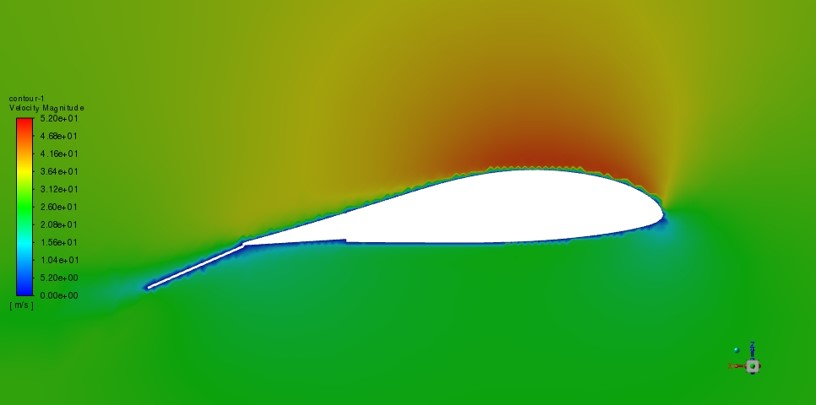
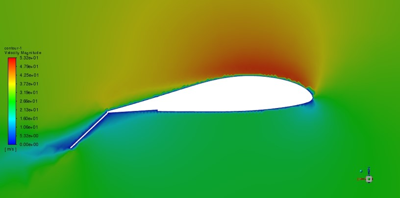

# CFD Analysis of Fixed-Wing UAV High-Lift Devices Using Ansys Fluent

> **Note:** This project was conducted during an internship under a confidentiality agreement.
> CAD/geometry files (SLDPRT) are excluded. Only post-processed results,
> visualizations, and methodology are shared here.

---

## Overview

A computational fluid dynamics (CFD) study comparing the aerodynamic performance of four
trailing-edge flap configurations on a fixed-wing UAV. The analysis evaluates how each flap type
affects lift, drag, pitching moment, and aerodynamic efficiency during take-off and landing phases.

---

## Flap Configurations Studied

| Flap Type | Description |
|-----------|-------------|
| Plain     | Simple hinged surface with no slot or extension |
| Split     | Lower surface deflects while upper surface remains fixed |
| Slotted   | Gap between main wing and flap enables high-energy airflow |
| Fowler    | Extends rearward and downward, increasing chord and camber |

---

## Operating Conditions

| Parameter            | Take-off Phase | Landing Phase |
|----------------------|----------------|---------------|
| Flap Deflection (δf) | 20°            | 40°           |
| Angle of Attack (α)  | −6° to +18°    | −6° to +18°   |

---

## Methodology

### Software & Tools
- **CFD Solver:** Ansys Fluent
- **CAD/Geometry:** (Proprietary — excluded per NDA)
- **Turbulence Model:** k-ω SST
- **Meshing Approach:** unstructured 

### Workflow
1. **Geometry Setup** — UAV wing geometry with interchangeable flap assemblies
2. **Meshing** — Domain sizing, inflation layers at wall boundaries, mesh independence study
3. **Boundary Conditions** — Freestream velocity, pressure outlet, no-slip wall conditions
4. **Solver Settings** — Steady-state RANS, 10^(-4)
5. **Post-Processing** — Extraction of aerodynamic coefficients 

---

## Results

### Aerodynamic Coefficients (vs. Angle of Attack)

The following plots compare all four flap types at both deflection angles:

| Output | Variable |
|--------|----------|
| Lift Coefficient | Cl vs α |
| Drag Coefficient | Cd vs α |
| Pitching Moment Coefficient | Cm vs α |
| Lift-to-Drag Ratio | L/D vs α |

> 📁 See `/results/` for all plots.

#### Sample — Cl vs α (Take-off, δf = 20°)

#### Sample — L/D vs α (Landing, δf = 40°)

---

## CFD Visualizations

Contour plots of pressure, velocity, and streamlines around each flap configuration:

| Configuration | Take-off (δf = 20°) | Landing (δf = 40°) |
|---------------|---------------------|---------------------|
| Plain Flap    |  |  |
| Split Flap    |  |  |
| Slotted Flap  |  |  |
| Fowler Flap   |  |  |

---

## Key Findings

- The **Fowler flap** produced the highest Cl at both deflection angles due to chord extension
  and increased camber.
- The **Slotted flap** showed improved stall characteristics, maintaining attached flow to
  higher angles of attack.
- The **Split flap** generated high drag with moderate lift, making it more suitable for
  steep landing approaches.
- The **Plain flap** offered the simplest performance trade-off, with the lowest gains in Cl.

---

## What Is NOT Included

Per confidentiality agreement with the internship company:
- SLDPRT / SolidWorks part files
- Any proprietary 3D CAD geometry
- Company-specific design parameters

---

## Skills Demonstrated

`Ansys Fluent` · `RANS CFD` · `Aerodynamic Analysis` · `High-Lift Device Design`
`Mesh Generation` · `Post-Processing` · `Fixed-Wing UAV` · `Engineering Reporting`

---

## Author

**Avicenna Najib Mahmud**
Aerospace / Mechanical Engineering Intern — 2022
